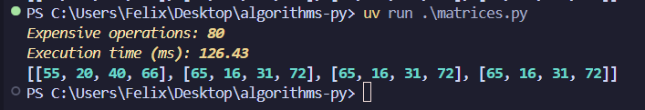

# `algorithms-py` - Various Algorithms, Implemented in Python

## Strongly Suggested VS Code Extension

[Comment Formula](https://marketplace.visualstudio.com/items?itemName=howcasperwhat.comment-formula) adds LaTeX formatting to comments, making displaying mathematical formulas inside of code possible.

## Performance Measuring

The `perf` module I wrote makes it trivial to measure any algorithm's performance:

```py
@perf.measure
def my_function():
    for i in range(100):
        # heavy calculation, etc.
        perf.expensive_op() # counter++
```

The rest will be handled automatically - no `print()` needed!


